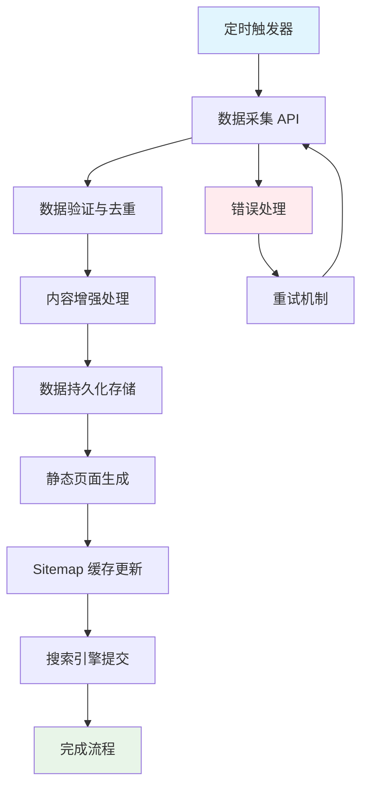

# Wordle 自动采集系统 - 通用业务逻辑移植指南

## 📋 概述

这是一个完整的 **Wordle 答案自动采集系统** 通用移植指南，包含核心业务逻辑、技术架构设计和跨框架适配方案。无论你使用 Next.js、Nuxt.js、SvelteKit、还是其他现代 Web 框架，都可以通过本指南快速实现相同的自动化功能。

## 🎯 核心业务价值

### 解决的问题
- **内容更新自动化**：无需人工干预，每日自动获取最新内容
- **SEO 流量获取**：通过大量长尾关键词页面获取搜索流量
- **用户体验优化**：提供历史数据查询和多种访问路径
- **搜索引擎友好**：自动生成和提交 sitemap，优化收录

### 商业价值
- **流量增长**：每个 Wordle 答案页面都是潜在的流量入口
- **用户粘性**：历史数据和统计功能增加用户停留时间
- **SEO 优势**：抢占 "wordle answer" 相关关键词排名
- **可扩展性**：同样逻辑可应用于其他每日更新的内容

## 🏗️ 核心业务逻辑架构

### 业务流程图


### 技术组件分层
```
┌─────────────────────────────────────────────────────────────┐
│                    触发层 (Trigger Layer)                   │
│  GitHub Actions | Vercel Cron | Cloudflare Cron | 手动触发  │
└─────────────────────────────────────────────────────────────┘
                                ↓
┌─────────────────────────────────────────────────────────────┐
│                   API 层 (API Layer)                       │
│     /api/update-wordle | /api/update-sitemap | /api/health  │
└─────────────────────────────────────────────────────────────┘
                                ↓
┌─────────────────────────────────────────────────────────────┐
│                  业务逻辑层 (Business Layer)                │
│   数据采集 | 内容增强 | 去重验证 | 错误处理 | 重试机制      │
└─────────────────────────────────────────────────────────────┘
                                ↓
┌─────────────────────────────────────────────────────────────┐
│                  数据层 (Data Layer)                       │
│      JSON 文件 | 数据库 | 缓存 | 文件系统 | 对象存储       │
└─────────────────────────────────────────────────────────────┘
                                ↓
┌─────────────────────────────────────────────────────────────┐
│                  展示层 (Presentation Layer)               │
│    动态路由 | 静态页面 | SEO 优化 | Sitemap | 多路径访问    │
└─────────────────────────────────────────────────────────────┘
```

## 🔧 核心业务逻辑实现

### 1. 数据采集核心逻辑

#### 通用数据采集函数
```typescript
// 框架无关的核心业务逻辑
interface WordleApiResponse {
  id: number;
  solution: string;
  print_date: string;
  days_since_launch: number;
  editor: string;
}

interface WordleAnswer extends WordleApiResponse {
  generated_at: string;
  seo_title: string;
  meta_description: string;
  tips: string[];
  difficulty: 'easy' | 'medium' | 'hard';
  hints: string[];
}

// 核心采集逻辑 - 可在任何框架中使用
export class WordleDataCollector {
  // 注意：实际采集使用日期特定的API，today.json已失效
  private readonly getApiUrl = (date: string) => `https://www.nytimes.com/svc/wordle/v2/${date}.json`;
  private readonly maxRetries = 3;
  private readonly retryDelay = 1000;

  async collectTodayData(): Promise<WordleAnswer> {
    console.log('[WordleCollector] 开始采集今日数据');
    
    // 步骤1: 获取原始数据
    const rawData = await this.fetchWithRetry();
    
    // 步骤2: 数据增强
    const enhancedData = this.enhanceData(rawData);
    
    // 步骤3: 数据验证
    this.validateData(enhancedData);
    
    console.log(`[WordleCollector] 采集完成: ${enhancedData.solution} (${enhancedData.print_date})`);
    return enhancedData;
  }

  private async fetchWithRetry(): Promise<WordleApiResponse> {
    for (let attempt = 1; attempt <= this.maxRetries; attempt++) {
      try {
        console.log(`[WordleCollector] 尝试获取数据 (${attempt}/${this.maxRetries})`);
        
        // 使用当前日期构建API URL
        const today = new Date().toISOString().split('T')[0]; // YYYY-MM-DD
        const apiUrl = this.getApiUrl(today);
        
        const response = await fetch(apiUrl, {
          headers: {
            'User-Agent': 'Mozilla/5.0 (compatible; WordleBot/1.0)',
            'Accept': 'application/json',
            'Cache-Control': 'no-cache'
          },
          timeout: 10000
        });

        if (!response.ok) {
          throw new Error(`API 请求失败: ${response.status} ${response.statusText}`);
        }

        const data = await response.json();
        console.log(`[WordleCollector] API 响应成功: ${data.solution}`);
        return data;
        
      } catch (error) {
        console.error(`[WordleCollector] 第 ${attempt} 次尝试失败:`, error.message);
        
        if (attempt === this.maxRetries) {
          throw new Error(`数据采集失败，已重试 ${this.maxRetries} 次: ${error.message}`);
        }
        
        // 指数退避重试
        await this.sleep(this.retryDelay * Math.pow(2, attempt - 1));
      }
    }
  }

  private enhanceData(rawData: WordleApiResponse): WordleAnswer {
    const formatDate = new Date(rawData.print_date).toLocaleDateString('en-US', {
      year: 'numeric',
      month: 'long',
      day: 'numeric'
    });

    return {
      ...rawData,
      generated_at: new Date().toISOString(),
      seo_title: `Wordle Answer Today - ${formatDate} - Puzzle #${rawData.id}`,
      meta_description: `Find today's Wordle answer for ${formatDate}. Puzzle #${rawData.id} solution: ${rawData.solution.toUpperCase()}, hints, and tips to solve the puzzle.`,
      tips: this.generateTips(rawData.solution),
      difficulty: this.calculateDifficulty(rawData.solution),
      hints: this.generateHints(rawData.solution)
    };
  }

  private generateTips(solution: string): string[] {
    const tips = [];
    const word = solution.toLowerCase();
    const commonLetters = ['e', 'a', 'r', 'i', 'o', 't', 'n', 's'];
    
    // 基于字母频率生成提示
    for (const letter of commonLetters) {
      if (word.includes(letter)) {
        tips.push(`This word contains the letter ${letter.toUpperCase()}`);
        if (tips.length >= 3) break;
      }
    }
    
    // 添加长度和首字母提示
    tips.push(`This is a ${word.length}-letter word`);
    tips.push(`The word starts with '${word[0].toUpperCase()}'`);
    
    return tips.slice(0, 3);
  }

  private calculateDifficulty(solution: string): 'easy' | 'medium' | 'hard' {
    const word = solution.toLowerCase();
    const commonLetters = ['e', 'a', 'r', 'i', 'o', 't', 'n', 's'];
    const uncommonLetters = ['q', 'x', 'z', 'j', 'k', 'v', 'w'];
    
    let score = 0;
    
    // 常见字母降低难度
    for (const letter of word) {
      if (commonLetters.includes(letter)) score -= 1;
      if (uncommonLetters.includes(letter)) score += 3;
    }
    
    // 重复字母增加难度
    const uniqueLetters = new Set(word).size;
    if (uniqueLetters < word.length) score += 2;
    
    if (score <= -2) return 'easy';
    if (score >= 3) return 'hard';
    return 'medium';
  }

  private generateHints(solution: string): string[] {
    // 这里可以集成更复杂的语义分析
    // 目前提供通用提示
    return [
      `Think of words that rhyme with "${solution.toLowerCase()}"`，
      'This is a common English word'
    ];
  }

  private validateData(data: WordleAnswer): void {
    if (!data.solution || data.solution.length !== 5) {
      throw new Error('无效的 Wordle 答案: 必须是5个字母');
    }
    
    if (!data.print_date || !data.id) {
      throw new Error('缺少必要的数据字段');
    }
    
    console.log('[WordleCollector] 数据验证通过');
  }

  private sleep(ms: number): Promise<void> {
    return new Promise(resolve => setTimeout(resolve, ms));
  }
}
```

### 2. 数据存储抽象层

#### 通用存储接口
```typescript
// 存储抽象接口 - 支持多种存储方案
export interface DataStorage {
  load(): Promise<Record<string, WordleAnswer>>;
  save(data: Record<string, WordleAnswer>): Promise<void>;
  exists(date: string): Promise<boolean>;
  get(date: string): Promise<WordleAnswer | null>;
  getLatest(): Promise<WordleAnswer | null>;
}

// JSON 文件存储实现
export class JsonFileStorage implements DataStorage {
  constructor(private filePath: string) {}

  async load(): Promise<Record<string, WordleAnswer>> {
    try {
      const fs = await import('fs/promises');
      const content = await fs.readFile(this.filePath, 'utf8');
      return JSON.parse(content);
    } catch (error) {
      if (error.code === 'ENOENT') {
        console.log('[Storage] 数据文件不存在，创建新文件');
        return {};
      }
      throw error;
    }
  }

  async save(data: Record<string, WordleAnswer>): Promise<void> {
    const fs = await import('fs/promises');
    const path = await import('path');
    
    // 确保目录存在
    await fs.mkdir(path.dirname(this.filePath), { recursive: true });
    
    // 写入数据
    await fs.writeFile(this.filePath, JSON.stringify(data, null, 2));
    console.log(`[Storage] 数据已保存到 ${this.filePath}`);
  }

  async exists(date: string): Promise<boolean> {
    const data = await this.load();
    return date in data;
  }

  async get(date: string): Promise<WordleAnswer | null> {
    const data = await this.load();
    return data[date] || null;
  }

  async getLatest(): Promise<WordleAnswer | null> {
    const data = await this.load();
    const dates = Object.keys(data).sort().reverse();
    return dates.length > 0 ? data[dates[0]] : null;
  }
}

// 数据库存储实现示例 (可选)
export class DatabaseStorage implements DataStorage {
  constructor(private db: any) {} // 数据库连接

  async load(): Promise<Record<string, WordleAnswer>> {
    const results = await this.db.query('SELECT * FROM wordle_answers ORDER BY print_date');
    const data = {};
    for (const row of results) {
      data[row.print_date] = row;
    }
    return data;
  }

  async save(data: Record<string, WordleAnswer>): Promise<void> {
    for (const [date, answer] of Object.entries(data)) {
      await this.db.query(
        'INSERT OR REPLACE INTO wordle_answers (print_date, data) VALUES (?, ?)',
        [date, JSON.stringify(answer)]
      );
    }
  }

  // ... 其他方法实现
}
```

### 3. 业务服务层

#### 核心业务服务
```typescript
export class WordleService {
  constructor(
    private collector: WordleDataCollector,
    private storage: DataStorage
  ) {}

  async updateTodayData(): Promise<{
    success: boolean;
    message: string;
    data?: WordleAnswer;
    isNew?: boolean;
  }> {
    try {
      console.log('[WordleService] 开始更新今日数据');
      
      // 步骤1: 采集数据
      const newData = await this.collector.collectTodayData();
      
      // 步骤2: 检查是否已存在
      const exists = await this.storage.exists(newData.print_date);
      if (exists) {
        console.log(`[WordleService] 数据已存在: ${newData.print_date}`);
        return {
          success: true,
          message: '数据已存在',
          data: newData,
          isNew: false
        };
      }
      
      // 步骤3: 保存新数据
      const allData = await this.storage.load();
      allData[newData.print_date] = newData;
      await this.storage.save(allData);
      
      console.log(`[WordleService] 新数据已保存: ${newData.print_date}`);
      return {
        success: true,
        message: '数据更新成功',
        data: newData,
        isNew: true
      };
      
    } catch (error) {
      console.error('[WordleService] 更新失败:', error);
      return {
        success: false,
        message: `更新失败: ${error.message}`
      };
    }
  }

  async getAnswer(identifier: string): Promise<WordleAnswer | null> {
    // 支持多种标识符格式
    if (identifier === 'today') {
      return await this.storage.getLatest();
    }
    
    // 期数格式 (1549 或 wordle-1549)
    if (/^(wordle-)?\d+$/.test(identifier)) {
      const puzzleId = parseInt(identifier.replace('wordle-', ''));
      const allData = await this.storage.load();
      
      for (const answer of Object.values(allData)) {
        if (answer.id === puzzleId) {
          return answer;
        }
      }
    }
    
    // 日期格式 (2025-01-15)
    if (/^\d{4}-\d{2}-\d{2}$/.test(identifier)) {
      return await this.storage.get(identifier);
    }
    
    return null;
  }

  async getAllAnswers(): Promise<WordleAnswer[]> {
    const allData = await this.storage.load();
    return Object.values(allData).sort((a, b) => 
      new Date(b.print_date).getTime() - new Date(a.print_date).getTime()
    );
  }

  async getStats(): Promise<{
    totalAnswers: number;
    latestDate: string;
    oldestDate: string;
    difficultyDistribution: Record<string, number>;
  }> {
    const answers = await this.getAllAnswers();
    
    const difficultyDistribution = answers.reduce((acc, answer) => {
      acc[answer.difficulty] = (acc[answer.difficulty] || 0) + 1;
      return acc;
    }, {} as Record<string, number>);
    
    return {
      totalAnswers: answers.length,
      latestDate: answers[0]?.print_date || '',
      oldestDate: answers[answers.length - 1]?.print_date || '',
      difficultyDistribution
    };
  }
}
```

## 🌐 跨框架适配指南

### Next.js 适配

#### API Routes 实现
```typescript
// pages/api/update-wordle.ts 或 app/api/update-wordle/route.ts
import { WordleDataCollector, JsonFileStorage, WordleService } from '@/lib/wordle';
import path from 'path';

// Next.js 13+ App Router
export async function POST(request: Request) {
  try {
    const collector = new WordleDataCollector();
    const storage = new JsonFileStorage(path.join(process.cwd(), 'data/wordle-answers.json'));
    const service = new WordleService(collector, storage);
    
    const result = await service.updateTodayData();
    
    return Response.json(result, { 
      status: result.success ? 200 : 500 
    });
  } catch (error) {
    return Response.json(
      { success: false, message: error.message },
      { status: 500 }
    );
  }
}

// Next.js 12 Pages Router
export default async function handler(req: NextApiRequest, res: NextApiResponse) {
  if (req.method !== 'POST') {
    return res.status(405).json({ error: 'Method not allowed' });
  }
  
  // 使用相同的业务逻辑
  const collector = new WordleDataCollector();
  const storage = new JsonFileStorage(path.join(process.cwd(), 'data/wordle-answers.json'));
  const service = new WordleService(collector, storage);
  
  const result = await service.updateTodayData();
  
  res.status(result.success ? 200 : 500).json(result);
}
```

#### 动态路由实现
```typescript
// pages/wordle-answer/[identifier].tsx
import { GetStaticPaths, GetStaticProps } from 'next';
import { WordleService, JsonFileStorage, WordleDataCollector } from '@/lib/wordle';

export const getStaticPaths: GetStaticPaths = async () => {
  const storage = new JsonFileStorage('data/wordle-answers.json');
  const service = new WordleService(new WordleDataCollector(), storage);
  const answers = await service.getAllAnswers();
  
  const paths = [];
  
  // 生成所有可能的路径
  for (const answer of answers) {
    paths.push({ params: { identifier: answer.print_date } });
    paths.push({ params: { identifier: answer.id.toString() } });
    paths.push({ params: { identifier: `wordle-${answer.id}` } });
  }
  
  paths.push({ params: { identifier: 'today' } });
  
  return { paths, fallback: 'blocking' };
};

export const getStaticProps: GetStaticProps = async ({ params }) => {
  const storage = new JsonFileStorage('data/wordle-answers.json');
  const service = new WordleService(new WordleDataCollector(), storage);
  
  const answer = await service.getAnswer(params.identifier as string);
  
  if (!answer) {
    return { notFound: true };
  }
  
  return {
    props: { answer },
    revalidate: 3600 // 1小时重新生成
  };
};
```

### Astro 适配

#### API Routes 实现
```typescript
// src/pages/api/update-wordle.ts
import type { APIRoute } from 'astro';
import { WordleDataCollector, JsonFileStorage, WordleService } from '@/lib/wordle';

export const POST: APIRoute = async ({ request }) => {
  try {
    const collector = new WordleDataCollector();
    const storage = new JsonFileStorage('data/wordle-answers.json');
    const service = new WordleService(collector, storage);
    
    const result = await service.updateTodayData();
    
    return new Response(JSON.stringify(result), {
      status: result.success ? 200 : 500,
      headers: {
        'Content-Type': 'application/json'
      }
    });
  } catch (error) {
    return new Response(JSON.stringify({
      success: false,
      message: error.message
    }), {
      status: 500,
      headers: {
        'Content-Type': 'application/json'
      }
    });
  }
};
```

#### 动态页面实现
```astro
---
// src/pages/wordle-answer/[identifier].astro
import Layout from '@/layouts/Layout.astro';
import { WordleService, JsonFileStorage, WordleDataCollector } from '@/lib/wordle';

export async function getStaticPaths() {
  const storage = new JsonFileStorage('data/wordle-answers.json');
  const service = new WordleService(new WordleDataCollector(), storage);
  const answers = await service.getAllAnswers();
  
  const paths = [];
  
  for (const answer of answers) {
    // 多种路径格式
    paths.push({
      params: { identifier: answer.print_date },
      props: { answer }
    });
    paths.push({
      params: { identifier: answer.id.toString() },
      props: { answer }
    });
    paths.push({
      params: { identifier: `wordle-${answer.id}` },
      props: { answer }
    });
  }
  
  // 今日路径
  const latestAnswer = answers[0];
  if (latestAnswer) {
    paths.push({
      params: { identifier: 'today' },
      props: { answer: latestAnswer }
    });
  }
  
  return paths;
}

const { answer } = Astro.props;
---

<Layout title={answer.seo_title}>
  <main class="container mx-auto px-4 py-8">
    <h1 class="text-3xl font-bold mb-6">{answer.seo_title}</h1>
    
    <div class="bg-white rounded-lg shadow-lg p-6">
      <div class="text-center mb-6">
        <div class="text-6xl font-bold text-green-600 mb-2">
          {answer.solution.toUpperCase()}
        </div>
        <p class="text-gray-600">{answer.print_date}</p>
        <p class="text-sm text-gray-500">Puzzle #{answer.id}</p>
      </div>
      
      <div class="grid md:grid-cols-2 gap-6">
        <div>
          <h3 class="text-xl font-semibold mb-3">解题提示</h3>
          <ul class="space-y-2">
            {answer.tips.map((tip) => (
              <li class="flex items-start">
                <span class="text-blue-500 mr-2">•</span>
                {tip}
              </li>
            ))}
          </ul>
        </div>
        
        <div>
          <h3 class="text-xl font-semibold mb-3">难度等级</h3>
          <div class={`inline-block px-3 py-1 rounded-full text-white ${
            answer.difficulty === 'easy' ? 'bg-green-500' :
            answer.difficulty === 'medium' ? 'bg-yellow-500' : 'bg-red-500'
          }`}>
            {answer.difficulty.toUpperCase()}
          </div>
          
          <h3 class="text-xl font-semibold mb-3 mt-6">提示线索</h3>
          <ul class="space-y-2">
            {answer.hints.map((hint) => (
              <li class="text-gray-700">{hint}</li>
            ))}
          </ul>
        </div>
      </div>
    </div>
  </main>
</Layout>
```

### Nuxt.js 适配

#### Server API 实现
```typescript
// server/api/update-wordle.post.ts
import { WordleDataCollector, JsonFileStorage, WordleService } from '~/lib/wordle';

export default defineEventHandler(async (event) => {
  try {
    const collector = new WordleDataCollector();
    const storage = new JsonFileStorage('data/wordle-answers.json');
    const service = new WordleService(collector, storage);
    
    const result = await service.updateTodayData();
    
    setResponseStatus(event, result.success ? 200 : 500);
    return result;
  } catch (error) {
    setResponseStatus(event, 500);
    return {
      success: false,
      message: error.message
    };
  }
});
```

#### 动态页面实现
```vue
<!-- pages/wordle-answer/[identifier].vue -->
<template>
  <div class="container mx-auto px-4 py-8">
    <h1 class="text-3xl font-bold mb-6">{{ answer.seo_title }}</h1>
    
    <div class="bg-white rounded-lg shadow-lg p-6">
      <div class="text-center mb-6">
        <div class="text-6xl font-bold text-green-600 mb-2">
          {{ answer.solution.toUpperCase() }}
        </div>
        <p class="text-gray-600">{{ answer.print_date }}</p>
        <p class="text-sm text-gray-500">Puzzle #{{ answer.id }}</p>
      </div>
      
      <div class="grid md:grid-cols-2 gap-6">
        <div>
          <h3 class="text-xl font-semibold mb-3">解题提示</h3>
          <ul class="space-y-2">
            <li v-for="tip in answer.tips" :key="tip" class="flex items-start">
              <span class="text-blue-500 mr-2">•</span>
              {{ tip }}
            </li>
          </ul>
        </div>
        
        <div>
          <h3 class="text-xl font-semibold mb-3">难度等级</h3>
          <div :class="difficultyClass" class="inline-block px-3 py-1 rounded-full text-white">
            {{ answer.difficulty.toUpperCase() }}
          </div>
        </div>
      </div>
    </div>
  </div>
</template>

<script setup>
import { WordleService, JsonFileStorage, WordleDataCollector } from '~/lib/wordle';

const route = useRoute();
const identifier = route.params.identifier;

// 服务端数据获取
const { data: answer } = await $fetch(`/api/wordle-answer/${identifier}`);

if (!answer) {
  throw createError({
    statusCode: 404,
    statusMessage: 'Wordle answer not found'
  });
}

// SEO 优化
useHead({
  title: answer.seo_title,
  meta: [
    { name: 'description', content: answer.meta_description },
    { property: 'og:title', content: answer.seo_title },
    { property: 'og:description', content: answer.meta_description }
  ]
});

// 计算属性
const difficultyClass = computed(() => {
  switch (answer.difficulty) {
    case 'easy': return 'bg-green-500';
    case 'medium': return 'bg-yellow-500';
    case 'hard': return 'bg-red-500';
    default: return 'bg-gray-500';
  }
});
</script>
```

### SvelteKit 适配

#### API Routes 实现
```typescript
// src/routes/api/update-wordle/+server.ts
import { json } from '@sveltejs/kit';
import { WordleDataCollector, JsonFileStorage, WordleService } from '$lib/wordle';
import type { RequestHandler } from './$types';

export const POST: RequestHandler = async ({ request }) => {
  try {
    const collector = new WordleDataCollector();
    const storage = new JsonFileStorage('data/wordle-answers.json');
    const service = new WordleService(collector, storage);
    
    const result = await service.updateTodayData();
    
    return json(result, { 
      status: result.success ? 200 : 500 
    });
  } catch (error) {
    return json(
      { success: false, message: error.message },
      { status: 500 }
    );
  }
};
```

#### 动态页面实现
```typescript
// src/routes/wordle-answer/[identifier]/+page.server.ts
import { error } from '@sveltejs/kit';
import { WordleService, JsonFileStorage, WordleDataCollector } from '$lib/wordle';
import type { PageServerLoad } from './$types';

export const load: PageServerLoad = async ({ params }) => {
  const storage = new JsonFileStorage('data/wordle-answers.json');
  const service = new WordleService(new WordleDataCollector(), storage);
  
  const answer = await service.getAnswer(params.identifier);
  
  if (!answer) {
    throw error(404, 'Wordle answer not found');
  }
  
  return {
    answer
  };
};
```

```svelte
<!-- src/routes/wordle-answer/[identifier]/+page.svelte -->
<script lang="ts">
  import type { PageData } from './$types';
  
  export let data: PageData;
  $: answer = data.answer;
  
  $: difficultyClass = {
    easy: 'bg-green-500',
    medium: 'bg-yellow-500',
    hard: 'bg-red-500'
  }[answer.difficulty] || 'bg-gray-500';
</script>

<svelte:head>
  <title>{answer.seo_title}</title>
  <meta name="description" content={answer.meta_description} />
  <meta property="og:title" content={answer.seo_title} />
  <meta property="og:description" content={answer.meta_description} />
</svelte:head>

<div class="container mx-auto px-4 py-8">
  <h1 class="text-3xl font-bold mb-6">{answer.seo_title}</h1>
  
  <div class="bg-white rounded-lg shadow-lg p-6">
    <div class="text-center mb-6">
      <div class="text-6xl font-bold text-green-600 mb-2">
        {answer.solution.toUpperCase()}
      </div>
      <p class="text-gray-600">{answer.print_date}</p>
      <p class="text-sm text-gray-500">Puzzle #{answer.id}</p>
    </div>
    
    <div class="grid md:grid-cols-2 gap-6">
      <div>
        <h3 class="text-xl font-semibold mb-3">解题提示</h3>
        <ul class="space-y-2">
          {#each answer.tips as tip}
            <li class="flex items-start">
              <span class="text-blue-500 mr-2">•</span>
              {tip}
            </li>
          {/each}
        </ul>
      </div>
      
      <div>
        <h3 class="text-xl font-semibold mb-3">难度等级</h3>
        <div class="{difficultyClass} inline-block px-3 py-1 rounded-full text-white">
          {answer.difficulty.toUpperCase()}
        </div>
      </div>
    </div>
  </div>
</div>
```

## 🔄 Sitemap 自动更新系统

### 通用 Sitemap 生成器
```typescript
export class SitemapGenerator {
  constructor(
    private baseUrl: string,
    private storage: DataStorage
  ) {}

  async generateSitemap(): Promise<string> {
    const answers = await this.storage.load();
    const staticPages = this.getStaticPages();
    
    const urls = [];
    
    // 添加静态页面
    for (const page of staticPages) {
      urls.push(this.createUrlEntry(page.url, page.priority, page.changefreq));
    }
    
    // 添加 Wordle 答案页面
    for (const [date, answer] of Object.entries(answers)) {
      // 日期路径
      urls.push(this.createUrlEntry(
        `/wordle-answer/${date}`,
        0.8,
        'daily',
        answer.generated_at
      ));
      
      // 期数路径
      urls.push(this.createUrlEntry(
        `/wordle-answer/${answer.id}`,
        0.8,
        'daily',
        answer.generated_at
      ));
      
      // 带前缀期数路径
      urls.push(this.createUrlEntry(
        `/wordle-answer/wordle-${answer.id}`,
        0.7,
        'daily',
        answer.generated_at
      ));
    }
    
    // 今日答案页面
    urls.push(this.createUrlEntry(
      '/wordle-answer/today',
      0.9,
      'daily'
    ));
    
    // 排序并生成 XML
    urls.sort((a, b) => b.priority - a.priority || a.url.localeCompare(b.url));
    
    return this.generateXML(urls);
  }

  private getStaticPages() {
    return [
      { url: '/', priority: 1.0, changefreq: 'daily' },
      { url: '/games/wordle-unlimited', priority: 0.9, changefreq: 'weekly' },
      { url: '/games/connections-unlimited', priority: 0.9, changefreq: 'weekly' },
      { url: '/leaderboard', priority: 0.7, changefreq: 'daily' },
      { url: '/help', priority: 0.5, changefreq: 'monthly' }
    ];
  }

  private createUrlEntry(
    path: string,
    priority: number,
    changefreq: string,
    lastmod?: string
  ) {
    return {
      url: `${this.baseUrl}${path}`,
      priority,
      changefreq,
      lastmod: lastmod || new Date().toISOString()
    };
  }

  private generateXML(urls: any[]): string {
    const urlEntries = urls.map(url => `
  <url>
    <loc>${url.url}</loc>
    <lastmod>${url.lastmod}</lastmod>
    <changefreq>${url.changefreq}</changefreq>
    <priority>${url.priority}</priority>
  </url>`).join('');

    return `<?xml version="1.0" encoding="UTF-8"?>
<urlset xmlns="http://www.sitemaps.org/schemas/sitemap/0.9">${urlEntries}
</urlset>`;
  }

  async submitToSearchEngines(): Promise<{
    google: 'success' | 'failed';
    bing: 'success' | 'failed';
  }> {
    const sitemapUrl = `${this.baseUrl}/sitemap.xml`;
    const results = { google: 'failed' as const, bing: 'failed' as const };
    
    try {
      // 提交到 Google (使用 IndexNow)
      const googleResponse = await fetch('https://www.google.com/ping', {
        method: 'GET',
        headers: { 'User-Agent': 'SitemapBot/1.0' }
      });
      
      if (googleResponse.ok) {
        results.google = 'success';
      }
    } catch (error) {
      console.error('Google sitemap 提交失败:', error);
    }
    
    try {
      // 提交到 Bing
      const bingResponse = await fetch(`https://www.bing.com/ping?sitemap=${encodeURIComponent(sitemapUrl)}`);
      
      if (bingResponse.ok) {
        results.bing = 'success';
      }
    } catch (error) {
      console.error('Bing sitemap 提交失败:', error);
    }
    
    return results;
  }
}
```

## ⚙️ 定时任务配置

### GitHub Actions 通用配置
```yaml
# .github/workflows/update-wordle-data.yml
name: Update Wordle Data

on:
  schedule:
    # 每日 UTC 10:05 和 10:30 执行 (纽约时报通常在 UTC 10:00 更新)
    - cron: '5 10 * * *'
    - cron: '30 10 * * *'
  workflow_dispatch: # 允许手动触发
    inputs:
      force_update:
        description: '强制更新 (即使数据已存在)'
        required: false
        default: 'false'
        type: boolean

jobs:
  update-wordle:
    runs-on: ubuntu-latest
    
    steps:
      - name: Checkout repository
        uses: actions/checkout@v4
        
      - name: Setup Node.js
        uses: actions/setup-node@v4
        with:
          node-version: '18'
          cache: 'npm'
          
      - name: Install dependencies
        run: npm ci
        
      - name: Update Wordle data
        env:
          SITE_URL: ${{ secrets.SITE_URL }}
          CRON_SECRET: ${{ secrets.CRON_SECRET }}
          FORCE_UPDATE: ${{ github.event.inputs.force_update }}
        run: |
          echo "开始更新 Wordle 数据..."
          
          # 构建查询参数
          QUERY_PARAMS=""
          if [ "$FORCE_UPDATE" = "true" ]; then
            QUERY_PARAMS="?force=true"
          fi
          
          # 调用更新 API
          RESPONSE=$(curl -s -w "\n%{http_code}" -X POST \
            "$SITE_URL/api/update-wordle$QUERY_PARAMS" \
            -H "Authorization: Bearer $CRON_SECRET" \
            -H "Content-Type: application/json" \
            -H "User-Agent: GitHub-Actions-WordleBot/1.0")
          
          # 解析响应
          HTTP_CODE=$(echo "$RESPONSE" | tail -n1)
          BODY=$(echo "$RESPONSE" | head -n -1)
          
          echo "HTTP Status: $HTTP_CODE"
          echo "Response: $BODY"
          
          # 检查是否成功
          if [ "$HTTP_CODE" -eq 200 ]; then
            echo "✅ Wordle 数据更新成功"
          else
            echo "❌ Wordle 数据更新失败"
            exit 1
          fi
          
      - name: Update sitemap
        env:
          SITE_URL: ${{ secrets.SITE_URL }}
          CRON_SECRET: ${{ secrets.CRON_SECRET }}
        run: |
          echo "开始更新 Sitemap..."
          
          RESPONSE=$(curl -s -w "\n%{http_code}" -X POST \
            "$SITE_URL/api/update-sitemap" \
            -H "Authorization: Bearer $CRON_SECRET" \
            -H "Content-Type: application/json")
          
          HTTP_CODE=$(echo "$RESPONSE" | tail -n1)
          BODY=$(echo "$RESPONSE" | head -n -1)
          
          echo "HTTP Status: $HTTP_CODE"
          echo "Response: $BODY"
          
          if [ "$HTTP_CODE" -eq 200 ]; then
            echo "✅ Sitemap 更新成功"
          else
            echo "⚠️ Sitemap 更新失败，但不影响主流程"
          fi
          
      - name: Notify on failure
        if: failure()
        env:
          WEBHOOK_URL: ${{ secrets.DISCORD_WEBHOOK_URL }} # 可选：Discord 通知
        run: |
          if [ -n "$WEBHOOK_URL" ]; then
            curl -X POST "$WEBHOOK_URL" \
              -H "Content-Type: application/json" \
              -d '{
                "content": "🚨 Wordle 数据更新失败！\n\n**时间**: '$(date)'\n**仓库**: ${{ github.repository }}\n**工作流**: ${{ github.workflow }}\n**运行ID**: ${{ github.run_id }}"
              }'
          fi
          
          echo "❌ 工作流执行失败，请检查日志"
```

### Vercel Cron Jobs 配置
```json
{
  "functions": {
    "pages/api/update-wordle.ts": {
      "maxDuration": 30
    },
    "pages/api/update-sitemap.ts": {
      "maxDuration": 15
    }
  },
  "crons": [
    {
      "path": "/api/update-wordle",
      "schedule": "5 10 * * *"
    },
    {
      "path": "/api/update-wordle",
      "schedule": "30 10 * * *"
    },
    {
      "path": "/api/update-sitemap",
      "schedule": "35 10 * * *"
    }
  ],
  "rewrites": [
    {
      "source": "/sitemap.xml",
      "destination": "/api/sitemap"
    }
  ],
  "headers": [
    {
      "source": "/api/sitemap",
      "headers": [
        {
          "key": "Content-Type",
          "value": "text/xml"
        },
        {
          "key": "Cache-Control",
          "value": "s-maxage=86400, stale-while-revalidate"
        }
      ]
    }
  ]
}
```

### Cloudflare Workers Cron 配置
```toml
# wrangler.toml
name = "puzzhub-wordle-cron"
main = "src/worker.js"
compatibility_date = "2024-01-15"

[triggers]
crons = ["5 10 * * *", "30 10 * * *"]

[env.production.vars]
SITE_URL = "https://your-domain.pages.dev"
CRON_SECRET = "your-production-secret"
```

```javascript
// src/worker.js
export default {
  async scheduled(event, env, ctx) {
    console.log('Cron job triggered:', event.cron);
    
    try {
      // 更新 Wordle 数据
      const updateResponse = await fetch(`${env.SITE_URL}/api/update-wordle`, {
        method: 'POST',
        headers: {
          'Authorization': `Bearer ${env.CRON_SECRET}`,
          'Content-Type': 'application/json',
          'User-Agent': 'Cloudflare-Worker-Cron/1.0'
        }
      });
      
      const updateResult = await updateResponse.json();
      console.log('Update result:', updateResult);
      
      if (updateResult.success && updateResult.isNew) {
        // 如果有新数据，更新 sitemap
        const sitemapResponse = await fetch(`${env.SITE_URL}/api/update-sitemap`, {
          method: 'POST',
          headers: {
            'Authorization': `Bearer ${env.CRON_SECRET}`,
            'Content-Type': 'application/json'
          }
        });
        
        const sitemapResult = await sitemapResponse.json();
        console.log('Sitemap result:', sitemapResult);
      }
      
    } catch (error) {
      console.error('Cron job failed:', error);
      
      // 可选：发送错误通知
      if (env.DISCORD_WEBHOOK_URL) {
        await fetch(env.DISCORD_WEBHOOK_URL, {
          method: 'POST',
          headers: { 'Content-Type': 'application/json' },
          body: JSON.stringify({
            content: `🚨 Wordle 定时任务失败: ${error.message}`
          })
        });
      }
    }
  }
};
```

## 🧪 测试和调试指南

### 本地测试脚本
```bash
#!/bin/bash
# test-wordle-system.sh

echo "🧪 开始测试 Wordle 自动采集系统"

# 设置测试环境
export SITE_URL="http://localhost:3000"
export CRON_SECRET="test-secret-key"

# 测试1: 数据采集 API
echo "\n📡 测试数据采集 API..."
RESPONSE=$(curl -s -w "\n%{http_code}" -X POST \
  "$SITE_URL/api/update-wordle" \
  -H "Authorization: Bearer $CRON_SECRET" \
  -H "Content-Type: application/json")

HTTP_CODE=$(echo "$RESPONSE" | tail -n1)
BODY=$(echo "$RESPONSE" | head -n -1)

if [ "$HTTP_CODE" -eq 200 ]; then
  echo "✅ 数据采集成功"
  echo "Response: $BODY"
else
  echo "❌ 数据采集失败 (HTTP $HTTP_CODE)"
  echo "Error: $BODY"
fi

# 测试2: Sitemap 更新
echo "\n🗺️ 测试 Sitemap 更新..."
SITEMAP_RESPONSE=$(curl -s -w "\n%{http_code}" -X POST \
  "$SITE_URL/api/update-sitemap" \
  -H "Authorization: Bearer $CRON_SECRET")

SITEMAP_CODE=$(echo "$SITEMAP_RESPONSE" | tail -n1)
SITEMAP_BODY=$(echo "$SITEMAP_RESPONSE" | head -n -1)

if [ "$SITEMAP_CODE" -eq 200 ]; then
  echo "✅ Sitemap 更新成功"
  echo "Response: $SITEMAP_BODY"
else
  echo "❌ Sitemap 更新失败 (HTTP $SITEMAP_CODE)"
  echo "Error: $SITEMAP_BODY"
fi

# 测试3: Sitemap XML 生成
echo "\n📄 测试 Sitemap XML 生成..."
XML_RESPONSE=$(curl -s -w "\n%{http_code}" "$SITE_URL/sitemap.xml")
XML_CODE=$(echo "$XML_RESPONSE" | tail -n1)

if [ "$XML_CODE" -eq 200 ]; then
  echo "✅ Sitemap XML 生成成功"
  echo "XML 长度: $(echo "$XML_RESPONSE" | head -n -1 | wc -c) 字符"
else
  echo "❌ Sitemap XML 生成失败 (HTTP $XML_CODE)"
fi

# 测试4: 数据文件检查
echo "\n📁 检查数据文件..."
if [ -f "data/wordle-answers.json" ]; then
  ENTRIES=$(cat data/wordle-answers.json | jq 'keys | length' 2>/dev/null || echo "无法解析")
  echo "✅ 数据文件存在，包含 $ENTRIES 条记录"
  
  # 显示最新记录
  LATEST=$(cat data/wordle-answers.json | jq -r 'to_entries | sort_by(.key) | last | .value | "\(.print_date): \(.solution)"' 2>/dev/null)
  echo "最新记录: $LATEST"
else
  echo "❌ 数据文件不存在"
fi

# 测试5: 页面访问测试
echo "\n🌐 测试页面访问..."
TEST_URLS=(
  "/wordle-answer/today"
  "/wordle-answer/1549"
  "/wordle-answer/2025-01-15"
)

for URL in "${TEST_URLS[@]}"; do
  PAGE_RESPONSE=$(curl -s -w "%{http_code}" "$SITE_URL$URL")
  PAGE_CODE=$(echo "$PAGE_RESPONSE" | tail -c 4)
  
  if [ "$PAGE_CODE" = "200" ]; then
    echo "✅ $URL - 访问成功"
  else
    echo "❌ $URL - 访问失败 (HTTP $PAGE_CODE)"
  fi
done

echo "\n🎉 测试完成！"
```

### 性能测试脚本
```javascript
// performance-test.js
const { performance } = require('perf_hooks');
const fetch = require('node-fetch');

class PerformanceTest {
  constructor(baseUrl, secret) {
    this.baseUrl = baseUrl;
    this.secret = secret;
  }

  async testDataCollection() {
    console.log('🚀 测试数据采集性能...');
    
    const start = performance.now();
    
    try {
      const response = await fetch(`${this.baseUrl}/api/update-wordle`, {
        method: 'POST',
        headers: {
          'Authorization': `Bearer ${this.secret}`,
          'Content-Type': 'application/json'
        }
      });
      
      const end = performance.now();
      const duration = end - start;
      
      const result = await response.json();
      
      console.log(`⏱️ 数据采集耗时: ${duration.toFixed(2)}ms`);
      console.log(`📊 响应状态: ${response.status}`);
      console.log(`📝 响应大小: ${JSON.stringify(result).length} 字符`);
      
      return { duration, status: response.status, success: result.success };
    } catch (error) {
      console.error('❌ 性能测试失败:', error.message);
      return { duration: -1, status: 500, success: false };
    }
  }

  async testSitemapGeneration() {
    console.log('🗺️ 测试 Sitemap 生成性能...');
    
    const start = performance.now();
    
    try {
      const response = await fetch(`${this.baseUrl}/sitemap.xml`);
      const content = await response.text();
      const end = performance.now();
      
      const duration = end - start;
      const urlCount = (content.match(/<url>/g) || []).length;
      
      console.log(`⏱️ Sitemap 生成耗时: ${duration.toFixed(2)}ms`);
      console.log(`📊 URL 数量: ${urlCount}`);
      console.log(`📝 XML 大小: ${content.length} 字符`);
      
      return { duration, urlCount, size: content.length };
    } catch (error) {
      console.error('❌ Sitemap 性能测试失败:', error.message);
      return { duration: -1, urlCount: 0, size: 0 };
    }
  }

  async runFullTest() {
    console.log('🧪 开始完整性能测试\n');
    
    const results = {
      dataCollection: await this.testDataCollection(),
      sitemapGeneration: await this.testSitemapGeneration()
    };
    
    console.log('\n📋 性能测试报告:');
    console.log('================');
    console.log(`数据采集: ${results.dataCollection.duration.toFixed(2)}ms`);
    console.log(`Sitemap生成: ${results.sitemapGeneration.duration.toFixed(2)}ms`);
    console.log(`总URL数量: ${results.sitemapGeneration.urlCount}`);
    
    // 性能评级
    const totalTime = results.dataCollection.duration + results.sitemapGeneration.duration;
    let grade = 'A';
    if (totalTime > 5000) grade = 'D';
    else if (totalTime > 3000) grade = 'C';
    else if (totalTime > 1000) grade = 'B';
    
    console.log(`\n🏆 性能评级: ${grade} (总耗时: ${totalTime.toFixed(2)}ms)`);
    
    return results;
  }
}

// 运行测试
if (require.main === module) {
  const tester = new PerformanceTest(
    process.env.SITE_URL || 'http://localhost:3000',
    process.env.CRON_SECRET || 'test-secret'
  );
  
  tester.runFullTest().catch(console.error);
}

module.exports = PerformanceTest;
```

### 错误监控和日志系统
```typescript
// lib/monitoring.ts
export class MonitoringService {
  private static instance: MonitoringService;
  private logs: Array<{ timestamp: string; level: string; message: string; data?: any }> = [];

  static getInstance(): MonitoringService {
    if (!MonitoringService.instance) {
      MonitoringService.instance = new MonitoringService();
    }
    return MonitoringService.instance;
  }

  log(level: 'info' | 'warn' | 'error', message: string, data?: any) {
     const logEntry = {
       timestamp: new Date().toISOString(),
       level,
       message,
       data
     };
     
     this.logs.push(logEntry);
     
     // 控制台输出
     const logMessage = `[${logEntry.timestamp}] [${level.toUpperCase()}] ${message}`;
     switch (level) {
       case 'error':
         console.error(logMessage, data);
         break;
       case 'warn':
         console.warn(logMessage, data);
         break;
       default:
         console.log(logMessage, data);
     }
     
     // 保持日志数量限制
     if (this.logs.length > 1000) {
       this.logs = this.logs.slice(-500);
     }
   }

   getLogs(level?: string, limit = 100): Array<any> {
     let filteredLogs = this.logs;
     
     if (level) {
       filteredLogs = this.logs.filter(log => log.level === level);
     }
     
     return filteredLogs.slice(-limit).reverse();
   }

   async sendAlert(message: string, data?: any) {
     this.log('error', message, data);
     
     // 发送到外部监控服务 (可选)
     if (process.env.DISCORD_WEBHOOK_URL) {
       try {
         await fetch(process.env.DISCORD_WEBHOOK_URL, {
           method: 'POST',
           headers: { 'Content-Type': 'application/json' },
           body: JSON.stringify({
             content: `🚨 **系统警报**\n\n**消息**: ${message}\n**时间**: ${new Date().toLocaleString()}\n**数据**: \`\`\`json\n${JSON.stringify(data, null, 2)}\n\`\`\``
           })
         });
       } catch (error) {
         console.error('发送警报失败:', error);
       }
     }
   }

   getSystemHealth(): {
     status: 'healthy' | 'warning' | 'critical';
     uptime: number;
     errorRate: number;
     lastError?: any;
   } {
     const now = Date.now();
     const oneHourAgo = now - 60 * 60 * 1000;
     
     const recentLogs = this.logs.filter(log => 
       new Date(log.timestamp).getTime() > oneHourAgo
     );
     
     const errorLogs = recentLogs.filter(log => log.level === 'error');
     const errorRate = recentLogs.length > 0 ? errorLogs.length / recentLogs.length : 0;
     
     let status: 'healthy' | 'warning' | 'critical' = 'healthy';
     if (errorRate > 0.5) status = 'critical';
     else if (errorRate > 0.1) status = 'warning';
     
     return {
       status,
       uptime: process.uptime(),
       errorRate,
       lastError: errorLogs[errorLogs.length - 1]
     };
   }
 }

 // 使用示例
 export function createMonitoredWordleService(): WordleService {
   const monitor = MonitoringService.getInstance();
   const collector = new WordleDataCollector();
   const storage = new JsonFileStorage('data/wordle-answers.json');
   
   // 包装服务以添加监控
   const service = new WordleService(collector, storage);
   const originalUpdate = service.updateTodayData.bind(service);
   
   service.updateTodayData = async () => {
     monitor.log('info', '开始 Wordle 数据更新');
     
     try {
       const result = await originalUpdate();
       
       if (result.success) {
         monitor.log('info', `Wordle 数据更新成功: ${result.data?.solution}`, {
           date: result.data?.print_date,
           isNew: result.isNew
         });
       } else {
         monitor.log('warn', `Wordle 数据更新失败: ${result.message}`);
       }
       
       return result;
     } catch (error) {
       monitor.sendAlert('Wordle 数据更新异常', {
         error: error.message,
         stack: error.stack
       });
       throw error;
     }
   };
   
   return service;
 }
 ```

## 📊 部署和运维指南

### 环境变量配置

#### 必需环境变量
```bash
# 基础配置
SITE_URL=https://your-domain.com
CRON_SECRET=your-super-secret-cron-key

# 可选配置
DISCORD_WEBHOOK_URL=https://discord.com/api/webhooks/...
SENTRY_DSN=https://your-sentry-dsn
GOOGLE_SEARCH_CONSOLE_KEY=your-gsc-key
```

#### 开发环境配置
```bash
# .env.local
SITE_URL=http://localhost:3000
CRON_SECRET=dev-secret-key
NODE_ENV=development
DEBUG=wordle:*
```

#### 生产环境配置
```bash
# .env.production
SITE_URL=https://your-production-domain.com
CRON_SECRET=production-super-secret-key
NODE_ENV=production
LOG_LEVEL=info
```

### 部署检查清单

#### 部署前检查
- [ ] **环境变量配置完整**
  - [ ] SITE_URL 设置正确
  - [ ] CRON_SECRET 足够安全
  - [ ] 可选服务配置 (Discord, Sentry)

- [ ] **代码质量检查**
  - [ ] 所有测试通过
  - [ ] 代码格式化完成
  - [ ] 类型检查无错误
  - [ ] 安全扫描通过

- [ ] **功能测试**
  - [ ] 本地数据采集测试
  - [ ] API 端点响应正常
  - [ ] Sitemap 生成正确
  - [ ] 页面路由工作正常

#### 部署后验证
- [ ] **基础功能验证**
  - [ ] 网站可正常访问
  - [ ] API 端点响应正常
  - [ ] 定时任务配置生效
  - [ ] 数据文件创建成功

- [ ] **监控设置**
  - [ ] 错误日志监控
  - [ ] 性能指标收集
  - [ ] 警报通知配置
  - [ ] 健康检查端点

- [ ] **SEO 优化验证**
  - [ ] Sitemap 可访问
  - [ ] 页面 meta 标签正确
  - [ ] 结构化数据有效
  - [ ] 搜索引擎提交成功

### 监控和维护

#### 健康检查 API
```typescript
// pages/api/health.ts
import { MonitoringService } from '@/lib/monitoring';
import { JsonFileStorage } from '@/lib/wordle';
import path from 'path';
import fs from 'fs';

export default async function handler(req: NextApiRequest, res: NextApiResponse) {
  try {
    const monitor = MonitoringService.getInstance();
    const health = monitor.getSystemHealth();
    
    // 检查数据文件
    const dataPath = path.join(process.cwd(), 'data/wordle-answers.json');
    const dataExists = fs.existsSync(dataPath);
    
    let dataInfo = { exists: false, entries: 0, lastUpdate: null };
    if (dataExists) {
      const data = JSON.parse(fs.readFileSync(dataPath, 'utf8'));
      const entries = Object.keys(data);
      dataInfo = {
        exists: true,
        entries: entries.length,
        lastUpdate: entries.length > 0 ? entries.sort().reverse()[0] : null
      };
    }
    
    // 检查 API 响应时间
    const apiStart = Date.now();
    // 模拟 API 调用
    await new Promise(resolve => setTimeout(resolve, 10));
    const apiResponseTime = Date.now() - apiStart;
    
    const healthStatus = {
      status: health.status,
      timestamp: new Date().toISOString(),
      uptime: health.uptime,
      system: {
        nodeVersion: process.version,
        platform: process.platform,
        memory: process.memoryUsage(),
        cpuUsage: process.cpuUsage()
      },
      data: dataInfo,
      performance: {
        apiResponseTime,
        errorRate: health.errorRate
      },
      lastError: health.lastError
    };
    
    const httpStatus = health.status === 'critical' ? 503 : 200;
    res.status(httpStatus).json(healthStatus);
    
  } catch (error) {
    res.status(500).json({
      status: 'error',
      message: error.message,
      timestamp: new Date().toISOString()
    });
  }
}
```

#### 日志查看 API
```typescript
// pages/api/logs.ts
import { MonitoringService } from '@/lib/monitoring';

export default function handler(req: NextApiRequest, res: NextApiResponse) {
  // 简单的认证检查
  const authHeader = req.headers.authorization;
  if (!authHeader || authHeader !== `Bearer ${process.env.CRON_SECRET}`) {
    return res.status(401).json({ error: 'Unauthorized' });
  }
  
  const monitor = MonitoringService.getInstance();
  const { level, limit } = req.query;
  
  const logs = monitor.getLogs(
    level as string,
    limit ? parseInt(limit as string) : 100
  );
  
  res.status(200).json({
    logs,
    total: logs.length,
    timestamp: new Date().toISOString()
  });
}
```

### 性能优化建议

#### 1. 缓存策略
```typescript
// 实现智能缓存
export class CachedWordleService extends WordleService {
  private cache = new Map<string, { data: any; timestamp: number }>();
  private cacheTimeout = 60 * 60 * 1000; // 1小时

  async getAnswer(identifier: string): Promise<WordleAnswer | null> {
    const cacheKey = `answer:${identifier}`;
    const cached = this.cache.get(cacheKey);
    
    if (cached && Date.now() - cached.timestamp < this.cacheTimeout) {
      return cached.data;
    }
    
    const result = await super.getAnswer(identifier);
    
    if (result) {
      this.cache.set(cacheKey, {
        data: result,
        timestamp: Date.now()
      });
    }
    
    return result;
  }

  clearCache() {
    this.cache.clear();
  }
}
```

#### 2. 数据库优化 (可选升级)
```sql
-- SQLite 数据库结构
CREATE TABLE wordle_answers (
  id INTEGER PRIMARY KEY,
  puzzle_id INTEGER UNIQUE NOT NULL,
  solution TEXT NOT NULL,
  print_date DATE UNIQUE NOT NULL,
  generated_at DATETIME DEFAULT CURRENT_TIMESTAMP,
  seo_title TEXT,
  meta_description TEXT,
  tips TEXT, -- JSON 格式
  difficulty TEXT CHECK(difficulty IN ('easy', 'medium', 'hard')),
  hints TEXT, -- JSON 格式
  created_at DATETIME DEFAULT CURRENT_TIMESTAMP,
  updated_at DATETIME DEFAULT CURRENT_TIMESTAMP
);

-- 索引优化
CREATE INDEX idx_print_date ON wordle_answers(print_date);
CREATE INDEX idx_puzzle_id ON wordle_answers(puzzle_id);
CREATE INDEX idx_difficulty ON wordle_answers(difficulty);
```

#### 3. CDN 和静态资源优化
```javascript
// next.config.js
module.exports = {
  images: {
    domains: ['your-cdn-domain.com'],
    formats: ['image/webp', 'image/avif']
  },
  
  async headers() {
    return [
      {
        source: '/sitemap.xml',
        headers: [
          {
            key: 'Cache-Control',
            value: 's-maxage=86400, stale-while-revalidate=43200'
          }
        ]
      },
      {
        source: '/wordle-answer/:path*',
        headers: [
          {
            key: 'Cache-Control',
            value: 's-maxage=3600, stale-while-revalidate=1800'
          }
        ]
      }
    ];
  },
  
  async rewrites() {
    return [
      {
        source: '/sitemap.xml',
        destination: '/api/sitemap'
      }
    ];
  }
};
```

## 🚀 扩展和定制指南

### 1. 添加新的内容源

#### 扩展到其他游戏
```typescript
// 通用游戏数据采集接口
export interface GameDataCollector<T> {
  collectTodayData(): Promise<T>;
  validateData(data: T): void;
}

// Connections 游戏采集器
export class ConnectionsDataCollector implements GameDataCollector<ConnectionsAnswer> {
  private readonly apiUrl = 'https://www.nytimes.com/svc/connections/v2/today.json';
  
  async collectTodayData(): Promise<ConnectionsAnswer> {
    // 实现 Connections 数据采集逻辑
    const response = await fetch(this.apiUrl);
    const data = await response.json();
    
    return this.enhanceData(data);
  }
  
  private enhanceData(rawData: any): ConnectionsAnswer {
    return {
      ...rawData,
      generated_at: new Date().toISOString(),
      seo_title: `Connections Answer Today - ${rawData.print_date}`,
      meta_description: `Find today's Connections puzzle solution and hints.`,
      categories: this.generateCategoryHints(rawData.categories)
    };
  }
  
  validateData(data: ConnectionsAnswer): void {
    if (!data.categories || data.categories.length !== 4) {
      throw new Error('无效的 Connections 数据');
    }
  }
  
  private generateCategoryHints(categories: any[]): any[] {
    return categories.map(category => ({
      ...category,
      hint: this.generateHintForCategory(category)
    }));
  }
  
  private generateHintForCategory(category: any): string {
    // 基于分类生成提示逻辑
    return `Think about ${category.title.toLowerCase()}`;
  }
}
```

### 2. 多语言支持

#### 国际化配置
```typescript
// lib/i18n.ts
export interface LocaleConfig {
  code: string;
  name: string;
  wordleApiUrl?: string;
  dateFormat: string;
  seoTemplates: {
    title: string;
    description: string;
  };
}

export const locales: Record<string, LocaleConfig> = {
  'en': {
    code: 'en',
    name: 'English',
    // 注意：实际使用日期特定API，格式为 /v2/{YYYY-MM-DD}.json
    wordleApiUrl: 'https://www.nytimes.com/svc/wordle/v2/{date}.json',
    dateFormat: 'MMMM d, yyyy',
    seoTemplates: {
      title: 'Wordle Answer Today - {date} - Puzzle #{id}',
      description: 'Find today\'s Wordle answer for {date}. Puzzle #{id} solution: {solution}, hints, and tips.'
    }
  },
  'es': {
    code: 'es',
    name: 'Español',
    dateFormat: 'd de MMMM de yyyy',
    seoTemplates: {
      title: 'Respuesta Wordle Hoy - {date} - Puzzle #{id}',
      description: 'Encuentra la respuesta del Wordle de hoy para {date}. Solución del puzzle #{id}: {solution}, pistas y consejos.'
    }
  },
  'fr': {
    code: 'fr',
    name: 'Français',
    dateFormat: 'd MMMM yyyy',
    seoTemplates: {
      title: 'Réponse Wordle Aujourd\'hui - {date} - Puzzle #{id}',
      description: 'Trouvez la réponse Wordle d\'aujourd\'hui pour {date}. Solution du puzzle #{id}: {solution}, indices et astuces.'
    }
  }
};

// 多语言数据采集器
export class MultiLanguageWordleCollector {
  constructor(private locale: string = 'en') {}
  
  async collectTodayData(): Promise<WordleAnswer> {
    const config = locales[this.locale];
    if (!config) {
      throw new Error(`不支持的语言: ${this.locale}`);
    }
    
    // 使用对应语言的 API 或数据源
    const today = new Date().toISOString().split('T')[0]; // YYYY-MM-DD
    const apiUrlTemplate = config.wordleApiUrl || locales.en.wordleApiUrl;
    const apiUrl = apiUrlTemplate.replace('{date}', today);
    
    const response = await fetch(apiUrl);
    const data = await response.json();
    
    return this.enhanceDataWithLocale(data, config);
  }
  
  private enhanceDataWithLocale(rawData: any, config: LocaleConfig): WordleAnswer {
    const formatDate = new Date(rawData.print_date).toLocaleDateString(config.code);
    
    return {
      ...rawData,
      locale: config.code,
      generated_at: new Date().toISOString(),
      seo_title: this.formatTemplate(config.seoTemplates.title, {
        date: formatDate,
        id: rawData.id,
        solution: rawData.solution
      }),
      meta_description: this.formatTemplate(config.seoTemplates.description, {
        date: formatDate,
        id: rawData.id,
        solution: rawData.solution.toUpperCase()
      }),
      tips: this.generateLocalizedTips(rawData.solution, config.code),
      difficulty: this.calculateDifficulty(rawData.solution),
      hints: this.generateLocalizedHints(rawData.solution, config.code)
    };
  }
  
  private formatTemplate(template: string, vars: Record<string, any>): string {
    return template.replace(/\{(\w+)\}/g, (match, key) => vars[key] || match);
  }
  
  private generateLocalizedTips(solution: string, locale: string): string[] {
    // 根据语言生成本地化提示
    const tipTemplates = {
      en: [
        'This word contains the letter {letter}',
        'This is a {length}-letter word',
        'The word starts with \'{first}\''
      ],
      es: [
        'Esta palabra contiene la letra {letter}',
        'Esta es una palabra de {length} letras',
        'La palabra comienza con \'{first}\''
      ],
      fr: [
        'Ce mot contient la lettre {letter}',
        'C\'est un mot de {length} lettres',
        'Le mot commence par \'{first}\''
      ]
    };
    
    const templates = tipTemplates[locale] || tipTemplates.en;
    const word = solution.toLowerCase();
    const tips = [];
    
    // 生成本地化提示
    const commonLetters = ['e', 'a', 'r', 'i', 'o', 't', 'n', 's'];
    for (const letter of commonLetters) {
      if (word.includes(letter) && tips.length < 2) {
        tips.push(this.formatTemplate(templates[0], { letter: letter.toUpperCase() }));
      }
    }
    
    tips.push(this.formatTemplate(templates[1], { length: word.length }));
    tips.push(this.formatTemplate(templates[2], { first: word[0].toUpperCase() }));
    
    return tips.slice(0, 3);
  }
  
  private generateLocalizedHints(solution: string, locale: string): string[] {
    // 生成本地化提示线索
    const hintTemplates = {
      en: [
        'Think of words that rhyme with "{word}"',
        'This is a common English word'
      ],
      es: [
        'Piensa en palabras que rimen con "{word}"',
        'Esta es una palabra común en español'
      ],
      fr: [
        'Pensez aux mots qui riment avec "{word}"',
        'C\'est un mot français courant'
      ]
    };
    
    const templates = hintTemplates[locale] || hintTemplates.en;
    
    return [
      this.formatTemplate(templates[0], { word: solution.toLowerCase() }),
      templates[1]
    ];
  }
  
  private calculateDifficulty(solution: string): 'easy' | 'medium' | 'hard' {
    // 复用原有难度计算逻辑
    const word = solution.toLowerCase();
    const commonLetters = ['e', 'a', 'r', 'i', 'o', 't', 'n', 's'];
    const uncommonLetters = ['q', 'x', 'z', 'j', 'k', 'v', 'w'];
    
    let score = 0;
    
    for (const letter of word) {
      if (commonLetters.includes(letter)) score -= 1;
      if (uncommonLetters.includes(letter)) score += 3;
    }
    
    const uniqueLetters = new Set(word).size;
    if (uniqueLetters < word.length) score += 2;
    
    if (score <= -2) return 'easy';
    if (score >= 3) return 'hard';
    return 'medium';
  }
}
```

### 3. 高级 SEO 优化

#### 结构化数据生成
```typescript
// lib/structured-data.ts
export class StructuredDataGenerator {
  generateWordleAnswerSchema(answer: WordleAnswer, baseUrl: string): object {
    return {
      '@context': 'https://schema.org',
      '@type': 'Article',
      headline: answer.seo_title,
      description: answer.meta_description,
      author: {
        '@type': 'Organization',
        name: 'PuzzHub',
        url: baseUrl
      },
      publisher: {
        '@type': 'Organization',
        name: 'PuzzHub',
        url: baseUrl,
        logo: {
          '@type': 'ImageObject',
          url: `${baseUrl}/logo.png`
        }
      },
      datePublished: answer.generated_at,
      dateModified: answer.generated_at,
      mainEntityOfPage: {
        '@type': 'WebPage',
        '@id': `${baseUrl}/wordle-answer/${answer.print_date}`
      },
      about: {
        '@type': 'Game',
        name: 'Wordle',
        description: 'A daily word puzzle game',
        gameItem: {
          '@type': 'Thing',
          name: `Wordle #${answer.id}`,
          description: `Today's Wordle answer: ${answer.solution}`
        }
      },
      keywords: [
        'wordle',
        'wordle answer',
        'wordle today',
        `wordle ${answer.id}`,
        answer.solution.toLowerCase(),
        'word puzzle',
        'daily puzzle'
      ].join(', ')
    };
  }
  
  generateBreadcrumbSchema(answer: WordleAnswer, baseUrl: string): object {
    return {
      '@context': 'https://schema.org',
      '@type': 'BreadcrumbList',
      itemListElement: [
        {
          '@type': 'ListItem',
          position: 1,
          name: 'Home',
          item: baseUrl
        },
        {
          '@type': 'ListItem',
          position: 2,
          name: 'Wordle Answers',
          item: `${baseUrl}/wordle-answers`
        },
        {
          '@type': 'ListItem',
          position: 3,
          name: `Wordle #${answer.id}`,
          item: `${baseUrl}/wordle-answer/${answer.print_date}`
        }
      ]
    };
  }
  
  generateFAQSchema(answer: WordleAnswer): object {
    return {
      '@context': 'https://schema.org',
      '@type': 'FAQPage',
      mainEntity: [
        {
          '@type': 'Question',
          name: `What is today's Wordle answer?`,
          acceptedAnswer: {
            '@type': 'Answer',
            text: `Today's Wordle answer is ${answer.solution.toUpperCase()}.`
          }
        },
        {
          '@type': 'Question',
          name: `What is Wordle puzzle #${answer.id}?`,
          acceptedAnswer: {
            '@type': 'Answer',
            text: `Wordle puzzle #${answer.id} was published on ${answer.print_date} and the answer is ${answer.solution.toUpperCase()}.`
          }
        },
        {
          '@type': 'Question',
          name: `How difficult is today's Wordle?`,
          acceptedAnswer: {
            '@type': 'Answer',
            text: `Today's Wordle is rated as ${answer.difficulty} difficulty.`
          }
        }
      ]
    };
  }
}
```

## 🎯 最佳实践总结

### 1. 代码组织原则
- **单一职责**: 每个类和函数只负责一个明确的功能
- **依赖注入**: 使用接口和依赖注入提高可测试性
- **错误处理**: 完善的错误处理和重试机制
- **日志记录**: 详细的操作日志便于调试和监控

### 2. 性能优化策略
- **缓存机制**: 合理使用缓存减少重复计算
- **异步处理**: 使用异步操作提高响应速度
- **资源管理**: 及时释放不需要的资源
- **批量操作**: 批量处理数据减少 I/O 操作

### 3. 安全考虑
- **输入验证**: 严格验证所有外部输入
- **权限控制**: API 端点需要适当的权限验证
- **敏感信息**: 不在日志中记录敏感信息
- **HTTPS**: 生产环境必须使用 HTTPS

### 4. 监控和维护
- **健康检查**: 定期检查系统健康状态
- **性能监控**: 监控关键性能指标
- **错误追踪**: 完善的错误追踪和报警机制
- **定期备份**: 重要数据的定期备份

### 5. SEO 优化
- **语义化 HTML**: 使用语义化的 HTML 结构
- **结构化数据**: 添加适当的结构化数据
- **页面性能**: 优化页面加载速度
- **移动友好**: 确保移动设备友好

## 🚀 快速开始模板

### 最小化实现示例
```typescript
// 最简单的实现 - 适合快速原型
import { WordleDataCollector, JsonFileStorage, WordleService } from './lib/wordle';

// 1. 创建服务实例
const collector = new WordleDataCollector();
const storage = new JsonFileStorage('data/wordle-answers.json');
const service = new WordleService(collector, storage);

// 2. API 端点 (Next.js 示例)
export default async function handler(req, res) {
  if (req.method !== 'POST') {
    return res.status(405).json({ error: 'Method not allowed' });
  }
  
  try {
    const result = await service.updateTodayData();
    res.status(200).json(result);
  } catch (error) {
    res.status(500).json({ error: error.message });
  }
}

// 3. 页面组件 (React 示例)
export function WordleAnswerPage({ answer }) {
  return (
    <div>
      <h1>{answer.seo_title}</h1>
      <div className="answer">{answer.solution.toUpperCase()}</div>
      <ul>
        {answer.tips.map((tip, index) => (
          <li key={index}>{tip}</li>
        ))}
      </ul>
    </div>
  );
}

// 4. 定时任务配置 (vercel.json)
{
  "crons": [
    {
      "path": "/api/update-wordle",
      "schedule": "5 10 * * *"
    }
  ]
}
```

## 📚 总结

这个通用业务逻辑移植指南提供了完整的 Wordle 自动采集系统实现方案，包括：

### 🎯 核心价值
1. **完全自动化**: 无需人工干预的数据采集和内容生成
2. **框架无关**: 可适配任何现代 Web 框架
3. **SEO 优化**: 自动生成搜索引擎友好的内容
4. **高可扩展**: 易于扩展到其他类型的内容采集

### 🛠️ 技术特点
1. **模块化设计**: 清晰的分层架构，易于维护和扩展
2. **错误处理**: 完善的错误处理和重试机制
3. **监控系统**: 内置监控和日志系统
4. **性能优化**: 缓存、异步处理等性能优化策略

### 🚀 实施建议
1. **从简单开始**: 先实现核心功能，再逐步添加高级特性
2. **测试驱动**: 编写充分的测试确保系统稳定性
3. **监控优先**: 从一开始就建立完善的监控体系
4. **文档维护**: 保持文档与代码同步更新

通过这个指南，你可以在任何项目中快速实现类似的自动化内容采集系统，不仅限于 Wordle，还可以扩展到其他需要定期更新内容的场景。关键是理解核心业务逻辑，然后根据具体需求进行适配和优化。